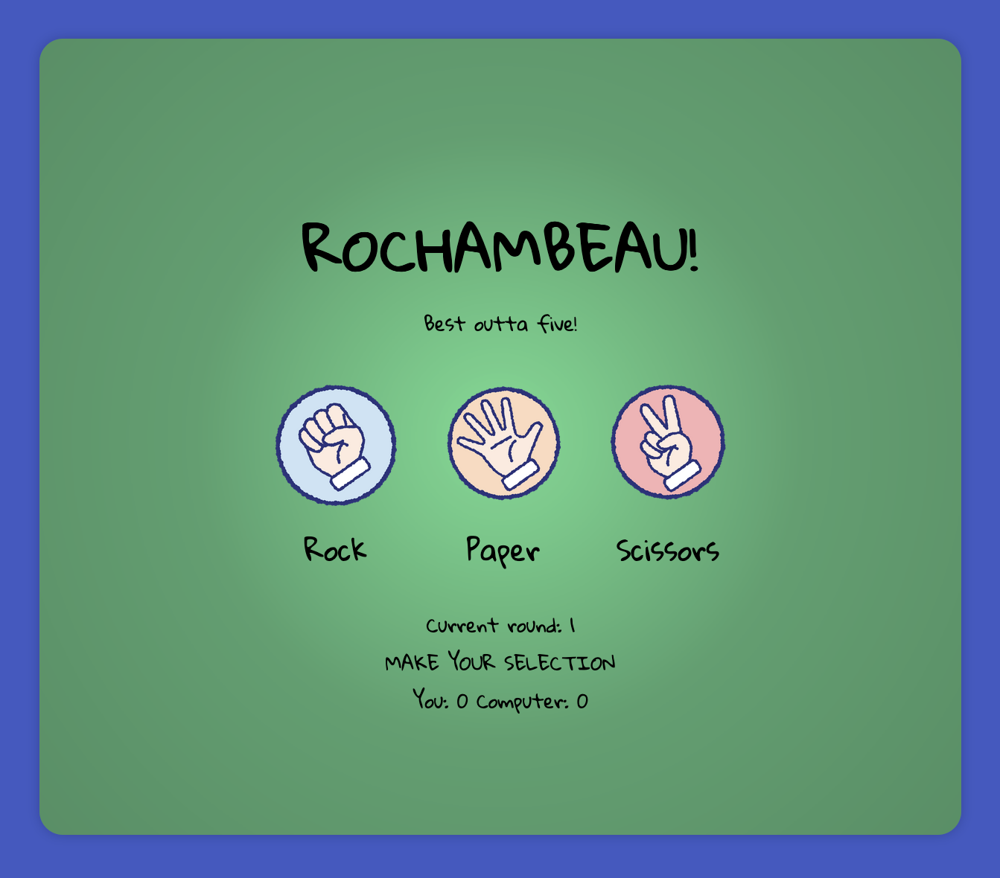

# ROCHAMBEAU

This is a solution to the [Rock Paper Scissors Project on The Odin Project](https://www.theodinproject.com/lessons/foundations-rock-paper-scissors).

## Table of contents

- [Overview](#overview)
  - [The challenge](#the-challenge)
  - [Screenshot](#screenshot)
  - [Links](#links)
- [My process](#my-process)
  - [Built with](#built-with)
  - [What I learned](#what-i-learned)
  - [Continued development](#continued-development)
- [Author](#author)

## Overview

### The challenge from The Odin Project

"We’re going to make a simple implementation of grade-school classic “rock paper scissors”. For the moment we’re just going to play the game from the browser console, but we will revisit this project in a later lesson and add a Graphical User Interface with buttons and text."
  -The Odin Project     

### Screenshots

### Links

- Solution URL: [Add solution URL here](https://github.com/micamash/rochambeau)
- Live Site URL: [Add live site URL here](https://micamash.github.io/rochambeau/)

## My process

First, I created the logic for the game itself. After I verified the logic in the console, I created the HTML and styled the page with CSS. After I completed that I returned to my Javascript and added some functions and selectors to complete the project.

### Built with

-HTML
-CSS
- JavaScript

### What I learned

I learned more about manipulating the DOM and got more practice with JavaScript during this exercise.

### Continued development

I plan to continue practicing JavaScript.

## Author

- [My Github](https://github.com/micamash/)
